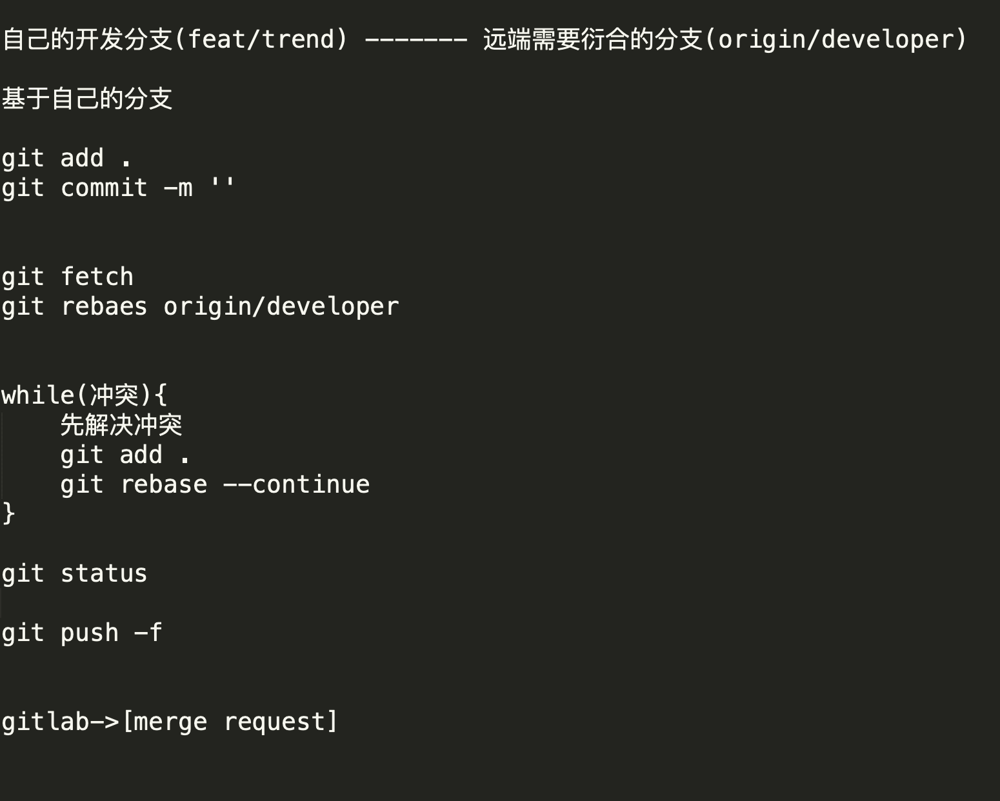

# flutter_imitation
模仿现有开源项目，以学习为目的，后续需要添加其他项目，需要开新的分支

# 合作形式
|项目名 | 源码地址 | 开发目录 | 所在分支| 分组
| -- | --| --| --| --|
|GankIO|https://github.com/lijinshanmx/flutter_gank |imitation/gank |gank| 1 |
|模仿豆瓣| https://github.com/kaina404/FlutterDouBan|imitation/douban|douban|2  |
|模仿wandroid| https://github.com/FlutterOpen/fun_fluttern|imitation/wandnroid|wandroid|3|
|模仿电影| https://github.com/Mayandev/morec|imitation/movie |movie|4 |
|Todo| https://github.com/burhanrashid52/WhatTodo|imitation/todo|todo| 5| 
|漫画|https://github.com/ZDfordream/FlutterTianYue|imitation/comic|comic| 6|
# Git提交规范
基本的git rebase模式

实例：如果你是基于gank分支，则自己需要创建一个类似feat/gank/niebin的分支开发，然后请求合并到gank分支
# 代码规范
参考此博客： https://juejin.im/post/5ba8d8086fb9a05cdc498aa5   
官网规范： https://dart.cn/guides/language/specifications/DartLangSpec-v2.2.pdf
